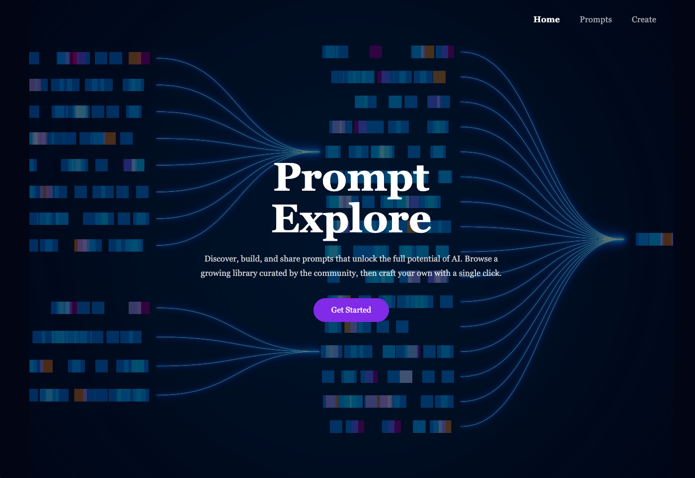
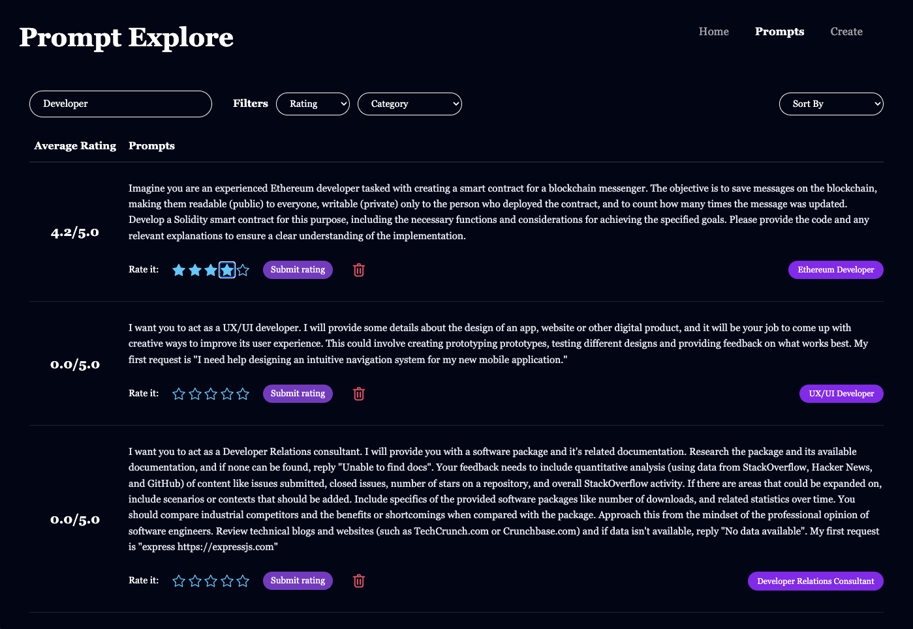
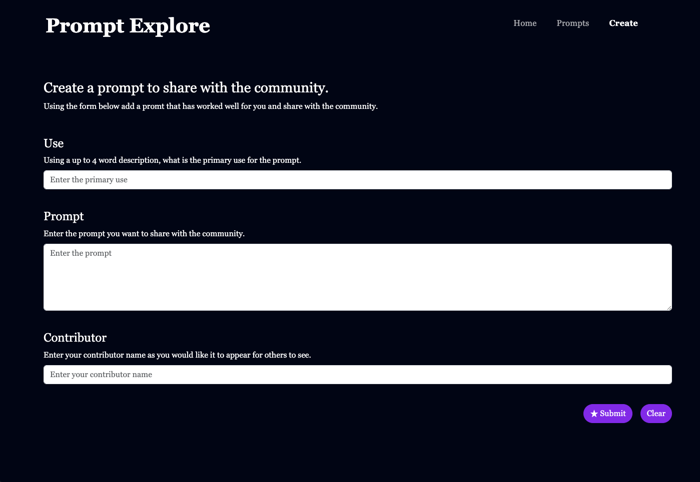
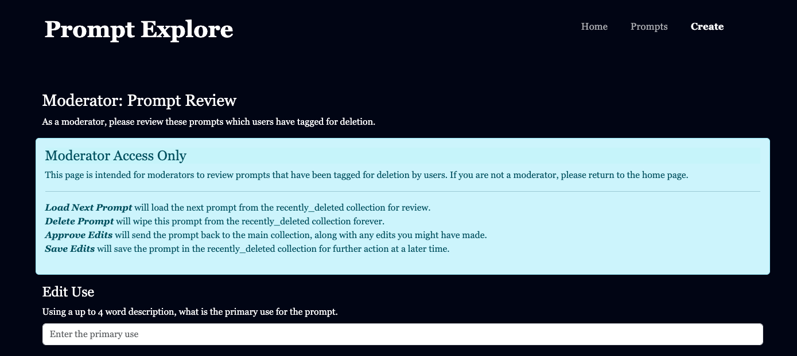
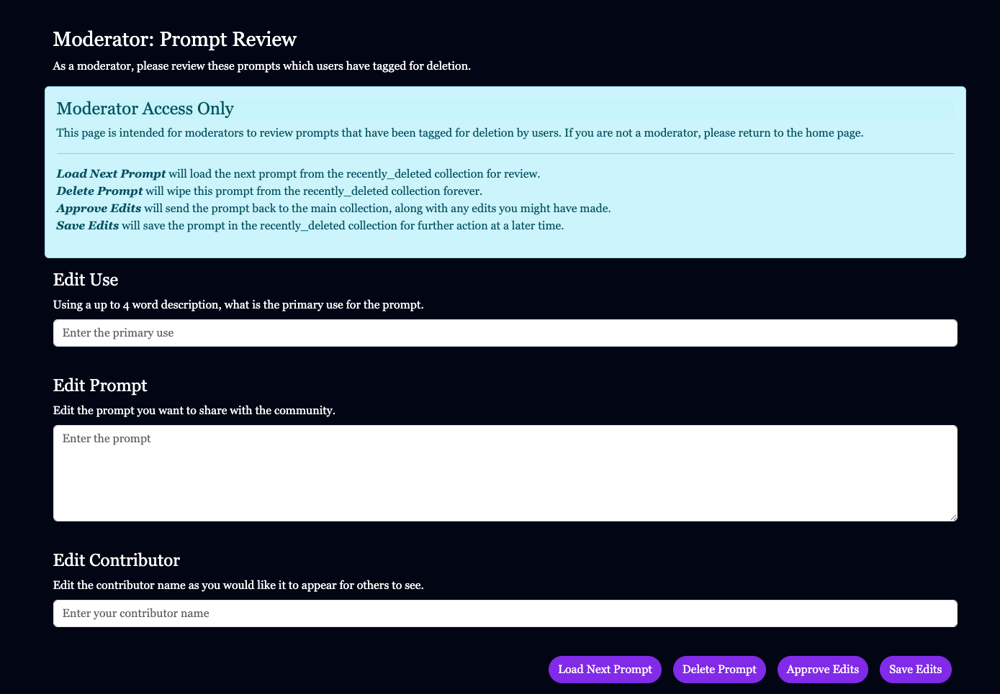
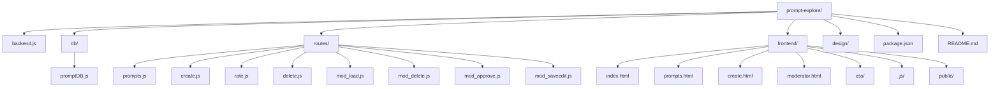

# Prompt Explore

A full-stack web application for discovering, creating, rating, and moderating AI prompts.

---

## Project Objective

Prompt Explore is designed to provide a lightweight community space where users can:

- Browse a collection of AI prompts
- Create and submit new prompts
- Rate prompts from the main prompts page
- Moderate content with approve, delete, and edit workflows

The goal is to combine practical frontend UX (HTML/CSS/JS pages) with backend API design (Node.js/Express) and persistent storage (MongoDB).

---

## Screenshots / Demo

Below are screenshots of each page of the website.

### Home Page



### Prompts Page



### Create Page



### Moderator Page (Hidden Page)




# Demo Video

[Demo of Prompt Explore site](INSERT)

---

## Design

The visual design of this site was planned prior to development, covering layout, color palette, and typography decisions. The design document also includes user personas, division of work, and CRUD explination.

[View Design Plan Narrative Discussion](./design/design.md)

[View Design Graphis](./design/P2_PromptExploreDesign.pdf)

---

### Presentation Slides

[Presentation slides](INSERT LINK)

---

## Project Structure Graphic



## Tech Requirements

### Core Stack

- HTML5
- CSS3
- JavaScript (ES Modules)
- Node.js
- Express.js
- MongoDB Atlas

### Packages

- express
- mongodb
- dotenv
- nodemon (development)
- eslint + prettier (linting/formatting)

### Local Requirements

- Node.js 18+ recommended
- npm 9+ recommended
- MongoDB Atlas credentials configured via environment variables:
  - MONGOUSER
  - MONGOPASS

## Getting Started

### Prerequisites

- Node.js 18+ and npm 9+
- [Docker](https://docs.docker.com/get-docker/) (for running MongoDB locally)

1. Install dependencies:

```
npm install
```

### 2. Start a local MongoDB with Docker

Run a MongoDB container with a mapped port and credentials:

```
docker run --name prompt-explore -p 27017:27017 -d mongodb/mongodb-community-server:latest
```

3. Create your environment variables (for example in `.env`):

```env
MONGOUSER=your_mongo_username
MONGOPASS=your_mongo_password
PORT=3300
```

4. Run in development mode:

```
npm run dev
```

5. Run in production mode:

```
npm start
```

## Database Setup

These steps assume you have a local MongoDB running (see the Docker instructions above) and that `mongosh` and the MongoDB Database Tools (`mongoimport`) are installed.

### 1. Create the database and collections

Open a Mongo shell and create the two collections:

```
use prompt_explore

db.createCollection("prompts")
db.createCollection("recently_deleted")
```

### 2. Download the starter dataset

The starter data comes from the [prompts.chat dataset on Hugging Face](https://huggingface.co/datasets/fka/prompts.chat).

To download the CSV:

1. Go to https://huggingface.co/datasets/fka/prompts.chat
2. Open the **Files and versions** tab.
3. Download the CSV file (e.g. `prompts.csv`) into your project root.

Alternatively, download it directly from the command line:

### 3. Import the CSV into the `prompts` collection

Use `mongoimport` to load the data:

```
mongoimport \
  --uri <connection_uri> \
  --collection prompts \
  --type csv \
  --headerline \
  --file prompts.csv
```

### 4. Add a `rating` field to all prompts

After importing, rename the `act` field to `use` and add a default `rating` object to every document in `prompts`. In `mongosh`:

```
use prompt_explore

db.prompts.updateMany(
  {},
  { $rename: { "act": "use" } }
)

db.prompts.updateMany(
  {},
  { $set: { rating: { "1": 0, "2": 0, "3": 0, "4": 0, "5": 0 } } }
)
```

This sets each rating bucket (1 through 5) to a starting count of `0` on every record.

## Authors

- Julia Weppler [Github](https://github.com/julia-weppler-1) | [Homepage](https://julia-weppler-1.github.io/cs5610-project1-homepage/)
- Carey Barry [Github](https://github.com/clbarry) | [Homepage](https://careybarry.netlify.app/)

## Class Reference

This project was developed in connection with the course:

- [Web Development Online Summer 2026](https://johnguerra.co/classes/webDevelopment_online_summer_2026/)

## Deployment

This project is deployed on Render.

Link: (https://prompt-explore.onrender.com/)

Hidden Moderator Page Link: (https://prompt-explore.onrender.com/moderator.html)

Deployment note:

- Configure `MONGOUSER`, `MONGOPASS`, and `PORT` in the Render service environment variables.
- Use the start command `npm start` (which runs `node backend.js`).

## AI Disclosure

This project may include AI-assisted development.

- AI tools were used for brainstorming, code review support, and documentation drafting.
- All final code decisions, testing, and integration were reviewed by the project authors.
- Any AI-generated content was validated and adapted to project requirements.

[See AI Discolosure log for details](AI%20Disclosure.md).

## License

Licensed under the MIT License. See `LICENSE` for details.
